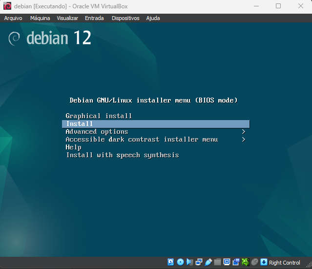
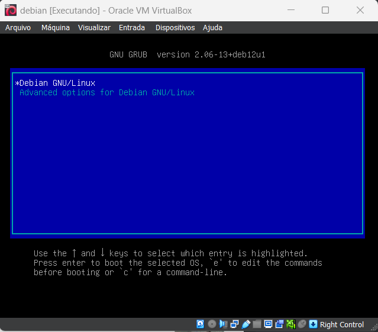
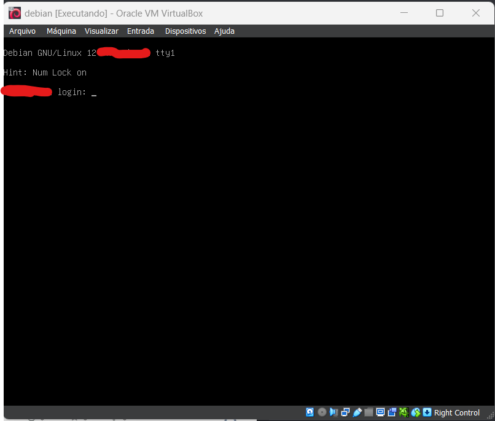

# born2beroot guide

My progress at 42 born2beroot project introduced the basis of virtual machines, SSH, cron jobs, shell scripts, servers, and more.

### Before start

- make sure you have downloaded your Linux distribution and installed Virtual Box. For this guide I chose Debian.
- if you have not downloaded Debian [download here](https://www.debian.org/download)
- if the virtual box is not installed download via the 42 package manager

### Getting started

1. Open your virtual box and tap on new.
2. follow the virtual box steps
3. with the VM installed let's begin.

### System Installation

1. Chose language, location, and timezone locale
2. configure keyboard
3. configure your hostname that must be `<intra_user>42`
4. configure your domain name. I did put `rio`
5. type and confirm your root password
6. create your system user
7. configure the clock set in São Paulo
8. this guide has the bonus partitions but you can [go to mandatory](./partition_mandatory.md) and [go to bonus](./partition_bonus.md) (you must complete this step to continue)
9. now you need to wait for the system to install
10. choose no at the network mirror option
11. set the package manager to `brazil` and `deb.debian.org` and just jump the proxy option
12. select no on the popularity contest
13. unselect everything on the software selection
14. select yes on the GRUB boot loader and select the disk to install the GRUB do not enter manually
15. now you need to wait for the system to install
16. after the installation is done select to reboot now

### Post-Installation

now you should see the GRUB menu

Congratulations you have installed your system. Now we will configure the system.
after put your disk password you should see the login screen

1. login with your system user (I recommend you to use the root user to configure the system, but you can use your system user)
2. type your system user password
3. now you should have access to your system terminal

### System Configuration

    after we continue run the command `lsblk` to see the partitions and compare with the subject to see if you did it right

### Mandatory part

[go to mandatory](./guide_mandatory.md)

### Bonus part

[go to bonus](./guide_bonus.md)
