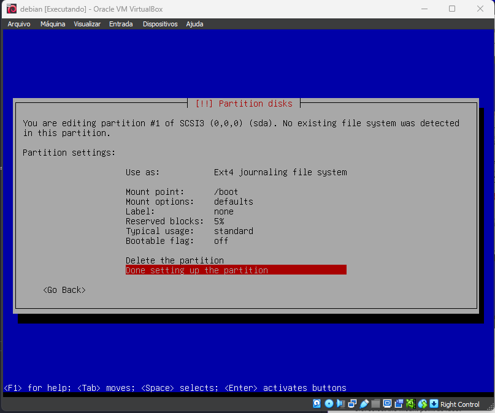
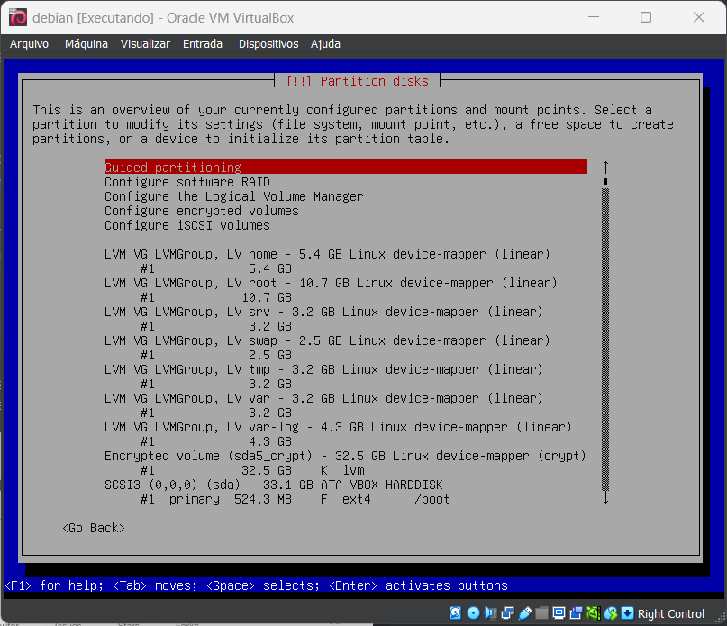

### BONUS PARTITION

I hope if you are here you succeded in the previous step. Now we will create the partitions. I will use the bonus partition method that is Manual

## Partition sizes

0. Disc size: 30.8 GiB
1. boot: 525M
2. root: 10.7
3. swap: 2.5G
4. home: 5.4G
5. var: 3.2G
6. srv: 3.2G
7. tmp: 3.2G
8. var-log: 4.3G

1. select the disk to partition

2. select the free space and create a new partition

3. create /boot partition
   3.1. select the free space and create a new partition
   3.2. select the size of the partition
   3.3. select the primary partition
   3.4. select the beginning of the space
   3.5. now use as ext4
   3.6. select the mount point as /boot
   3.7. select done setting up the partition

4. encrypt the rest of the disk
   4.1. select the option `Configure encrypted volumes` than yes
   4.2. select create encrypted volumes
   4.3. select the free space and create a new partition
   4.4. select done setting up the partition than select yes than finish than yes
   4.5. type the disk password
   4.6. now the partition is encrypted

after this your partitions should look like this

5. create the LVMGroup
   5.1. select the option `Configure the Logical Volume Manager` than yes
   5.2. select create volume group
   5.3. type the name of the volume group must be `LVMGroup`
   5.4. select the encrypted partition
   5.5. now you need to create the logical volumes

6. create the logical volumes
   6.1. select the option `Create logical volume` than yes
   6.2. choose the group volume
   6.3. type the name of the logical volume.
   6.4. select the size of the logical volume
   6.5. repeat the steps 6.1 to 6.4 to create the other logical volumes
   6.6 after creating all the logical volumes select finish
   6.7. after this your partitions should look like this
   
   6.8. now you need to configure each logical volume to a mount point and a file system type and select done setting up the partition
   6.9. after this your partitions should look like this
   
   6.10. now were done with the partitions select finish partitioning and write changes to disk than yes
