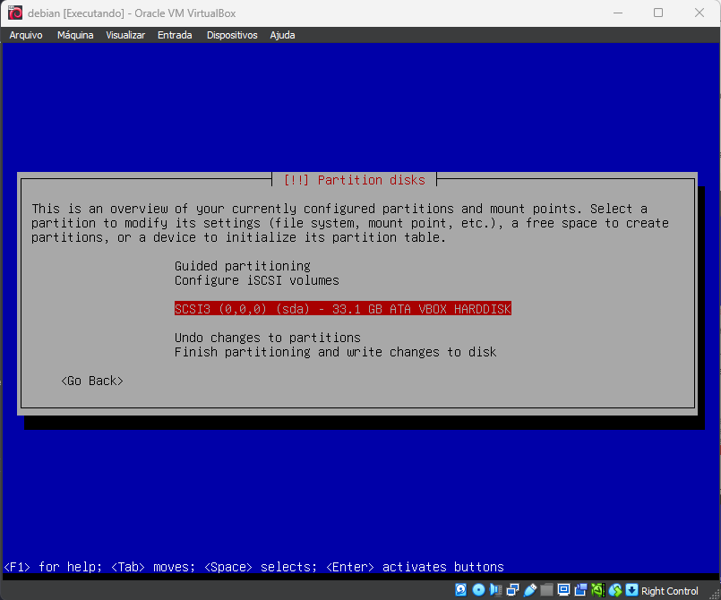

# MANDATORY PARTITIONS

## Partition sizes

0. Disc size: 8 GiB
1. boot: 511M
2. root: 3G
3. swap: 1023M
4. home: 4.1G

## Partition method

the partition method is `manual`

## Partition table

2. select the free space and create a new partition

3. create /boot partition
   1. select the free space and create a new partition
   2. select the size of the partition
   3. select the primary partition
   4. select the beginning of the space
   5. now use as ext4
   6. select the mount point as /boot
   7. select done setting up the partition

4. encrypt the rest of the disk
   1. select the option `Configure encrypted volumes` than yes
   2. select create encrypted volumes
   3. select the free space and create a new partition
   4. select done setting up the partition than select yes than finish than yes
   5. type the disk password
   6. now the partition is encrypted

5. create the partition group
   1. select the option `Configure the Logical Volume Manager` than yes
   2. select create volume group
   3. type the name of the volume group name on subject is `will-vg`
   4. select the encrypted partition
   5. now you need to create the logical volumes

6. create the logical volumes
   1. select the option `Create logical volume` than yes
   2. choose the group volume
   3. type the name of the logical volume.
   4. select the size of the logical volume
   5. repeat the steps 6.1 to 6.4 to create the other logical volumes
   6 after creating all the logical volumes select finish
   7. now you need to configure each logical volume to a mount point and a file system type and select done setting up the partition
   8. now were done with the partitions select finish partitioning and write changes to disk than yes
